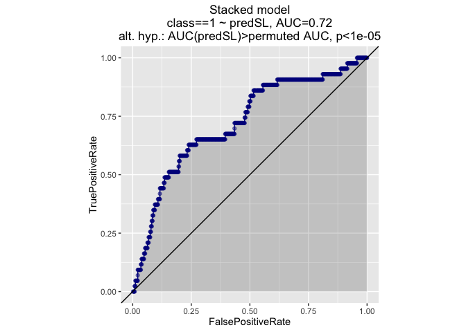
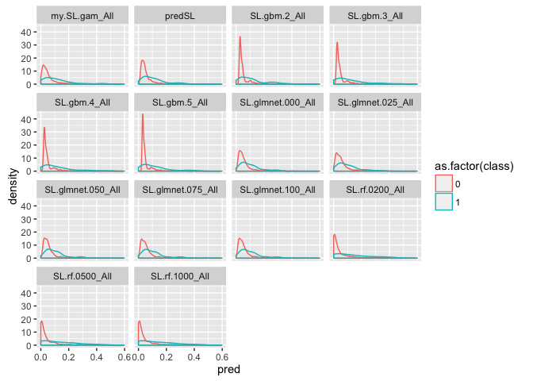
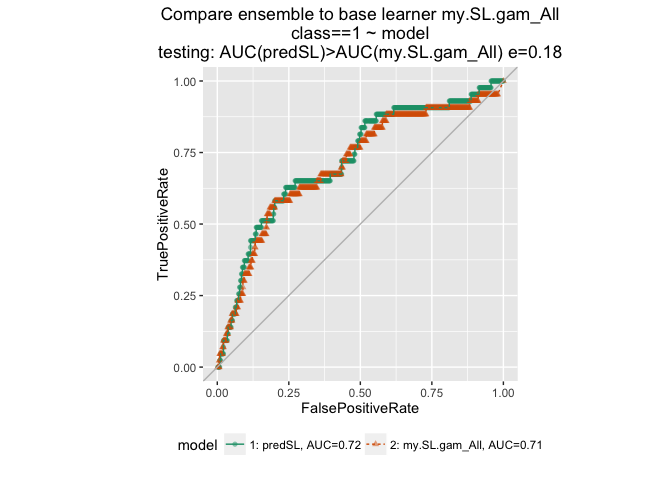
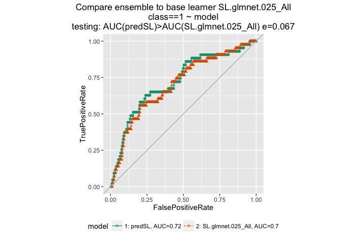
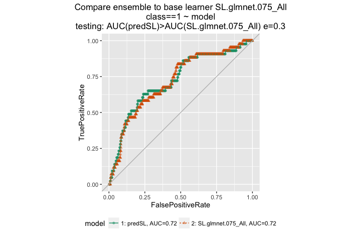
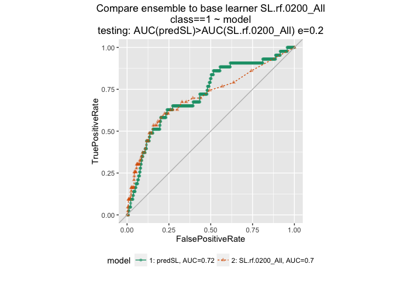
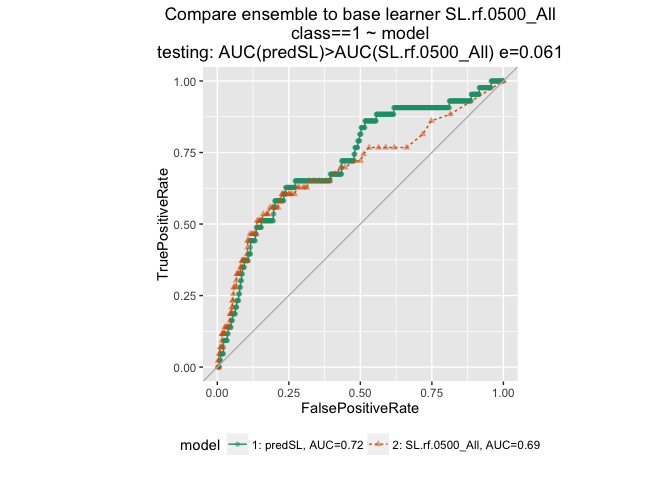
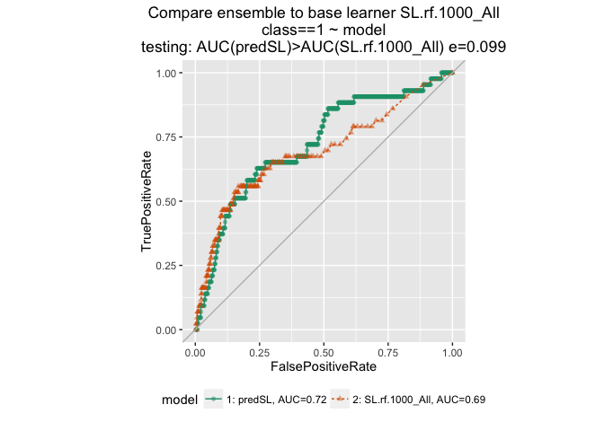
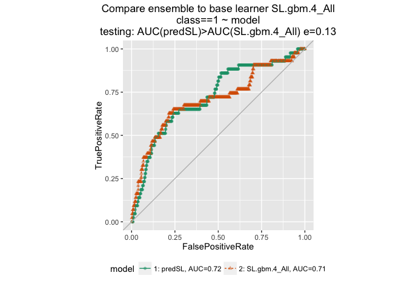

This run looks slightly different every time; can't reliably set seed with parallel clusters. (Though the initial data partitioning will be the same).

Read in data. The target class is rare (~5%) so stratify the holdout set.

``` r
# class is the outcome -- target is 1
sdata = read.arff("seismic-bumps.arff")

# outcome must be numeric, apparently. Target is 1
sdata$class = as.numeric(sdata$class=="1")
print(mean(sdata$class))
```

    ## [1] 0.06578947

``` r
y = "class"
# remove variables with no variation
x = setdiff(colnames(sdata), c(y, "nbumps6", "nbumps7", "nbumps89"))

N = nrow(sdata)

# returns 2 lists of indices
# intended to be used for partitioning data for
# stratified n-fold cross val. 
# 4-fold cross val: training set is 75% of data
index = vtreat::kWayStratifiedY(N, 4, NULL, sdata$class)
# get the indices from the first fold assignment
istrain = seq_len(N) %in% index[[1]]$train  

train = sdata[istrain,]
test = sdata[!istrain,]
print(mean(train$class))
```

    ## [1] 0.06553148

``` r
print(mean(test$class))
```

    ## [1] 0.06656347

Set learners. Use `listWrappers()` to see all the available ones

``` r
# use mgcv instead of gam package
my.SL.gam = function (Y, X, newX, family, obsWeights,deg.gam= 2, cts.num = 4, 
    ...) 
{
    cts.x <- apply(X, 2, function(x) (length(unique(x)) > cts.num))
    if (sum(!cts.x) > 0) {
        gam.model <- as.formula(paste("Y~", paste(paste("s(", 
            colnames(X[, cts.x, drop = FALSE]), ",k = ", deg.gam, 
            ")", sep = ""), collapse = "+"), "+", paste(colnames(X[, 
            !cts.x, drop = FALSE]), collapse = "+")))
    }
    else {
        gam.model <- as.formula(paste("Y~", paste(paste("s(", 
            colnames(X[, cts.x, drop = FALSE]), ",k = ", deg.gam, 
            ")", sep = ""), collapse = "+")))
    }
    if (sum(!cts.x) == length(cts.x)) {
        gam.model <- as.formula(paste("Y~", paste(colnames(X), 
            collapse = "+"), sep = ""))
    }
    fit.gam <- mgcv::gam(gam.model, data = cbind(X, Y), family = family, 
       # control = mgcv:gam.control(maxit = 50, bf.maxit = 50), 
        weights = obsWeights)
    pred <- mgcv::predict.gam(fit.gam, newdata = newX, type = "response")
    fit <- list(object = fit.gam)
    out <- list(pred = pred, fit = fit)
    class(out$fit) <- c("my.SL.gam")
    return(out)
}

predict.my.SL.gam = function(object, newdata,...) {
   pred <- mgcv::predict.gam(object = object$object, newdata = newdata, 
        type = "response")
    return(pred)
}

make.SL.glmnet = function(alpha) {
  function(...) {SL.glmnet(..., alpha=alpha)}
}

SL.glmnet.000 = make.SL.glmnet(0)
SL.glmnet.025= make.SL.glmnet(0.25)
SL.glmnet.050 = make.SL.glmnet(0.5)
SL.glmnet.075 = make.SL.glmnet(0.75)
SL.glmnet.100 = make.SL.glmnet(0.100)

# vary the number of trees
make.SL.rf = function(ntree) {
  function(...) {SL.randomForest(..., ntree=ntree, nodesize=10)}
}

SL.rf.0200 = make.SL.rf(200)
SL.rf.0500 = make.SL.rf(500)
SL.rf.1000 = make.SL.rf(1000)

# vary the interaction depth
make.SL.gbm = function(depth) {
  function(...) {SL.gbm(..., ntree=200, interaction.depth=depth)}
}

SL.gbm.2 = make.SL.gbm(2)
SL.gbm.3 = make.SL.gbm(3)
SL.gbm.4 = make.SL.gbm(4)
SL.gbm.5 = make.SL.gbm(5)

SL.library = c("my.SL.gam", 
               "SL.glmnet.000",
               "SL.glmnet.025",
               "SL.glmnet.050",               
               "SL.glmnet.075",
               "SL.glmnet.100",
               "SL.rf.0200",
               "SL.rf.0500",
               "SL.rf.1000",
               "SL.gbm.2", 
               "SL.gbm.3", 
               "SL.gbm.4", 
               "SL.gbm.5")
```

Stack a set of sublearners with non-negative least squares. 5-fold cross validation

``` r
# cl = parallel::makeCluster(4) # 4 nodes
# parallel::clusterExport(cl, c(SL.library, "predict.my.SL.gam")) # copy the functions to all nodes

# without parallel, use function SuperLearner()
# fit <- snowSuperLearner(cl, Y = train[,y], X = train[,x], 
#                     SL.library = SL.library,
#                     verbose = FALSE, 
#                     method = "method.NNLS", 
#                     family = binomial(),
#                     cvControl = SuperLearner.CV.control(V = 5L, stratifyCV = FALSE))

fit <- SuperLearner(Y = train[,y], X = train[,x], 
                    SL.library = SL.library,
                    verbose = FALSE, 
                    method = "method.NNLS", 
                    family = binomial(),
                    cvControl = SuperLearner.CV.control(V = 5L, stratifyCV = FALSE))


# parallel::stopCluster(cl)
```

``` r
pred <- predict(fit, newdata=test[,x])
pred.base  = pred$library.predict

test$predSL = as.numeric(pred$pred) 
ROCPlot(test, "predSL", "class", 1, "Stacked model")
```



Examine base learners

``` r
learners = paste0(SL.library, "_All")
labels=test$class

fit$coef
```

    ##     my.SL.gam_All SL.glmnet.000_All SL.glmnet.025_All SL.glmnet.050_All 
    ##        0.00000000        0.00000000        0.00000000        0.00000000 
    ## SL.glmnet.075_All SL.glmnet.100_All    SL.rf.0200_All    SL.rf.0500_All 
    ##        0.00000000        0.72064488        0.00000000        0.02802379 
    ##    SL.rf.1000_All      SL.gbm.2_All      SL.gbm.3_All      SL.gbm.4_All 
    ##        0.00000000        0.18100044        0.00000000        0.07033090 
    ##      SL.gbm.5_All 
    ##        0.00000000

``` r
# look at AUCs
cvAUC::AUC(predictions = test$predSL, labels=test$class)
```

    ## [1] 0.7223186

``` r
L <- length(learners)
labels=test$class
auc <- sapply(seq(L), function(l) cvAUC::AUC(predictions = as.data.frame(pred.base)[,l], 
                                             labels = labels))
data.frame(learners, auc)
```

    ##             learners       auc
    ## 1      my.SL.gam_All 0.7055035
    ## 2  SL.glmnet.000_All 0.7082032
    ## 3  SL.glmnet.025_All 0.7028809
    ## 4  SL.glmnet.050_All 0.7243627
    ## 5  SL.glmnet.075_All 0.7177678
    ## 6  SL.glmnet.100_All 0.7099001
    ## 7     SL.rf.0200_All 0.7037294
    ## 8     SL.rf.0500_All 0.6922365
    ## 9     SL.rf.1000_All 0.6926993
    ## 10      SL.gbm.2_All 0.7046165
    ## 11      SL.gbm.3_All 0.7047900
    ## 12      SL.gbm.4_All 0.7066605
    ## 13      SL.gbm.5_All 0.7078946

``` r
results = cbind(test[, c("class", "predSL")], pred.base)

results$index = 1:nrow(results)
resultslong = tidyr::gather_(results, key_col="learner", 
                             value_col="pred",
                            gather_cols=c("predSL", learners))

ggplot(resultslong, aes(x=pred, color=as.factor(class))) + geom_density() + facet_wrap(~learner)
```



``` r
for(l in learners) {
  title = paste("Compare ensemble to base learner", l)
  print(ROCPlotPair(results, "predSL", l, "class", 1, title))
}
```


