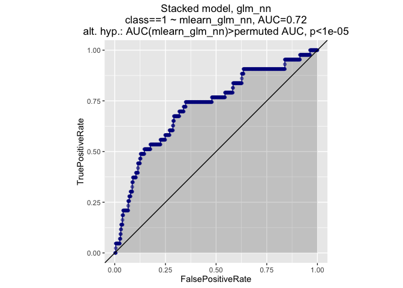
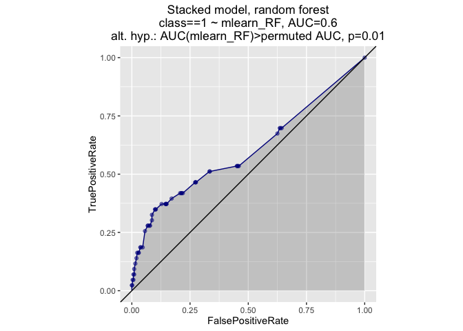
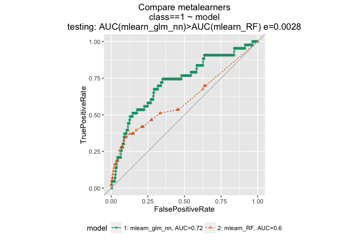

This run looks slightly different every time; can't reliably set seed with parallel clusters. (Though the initial data partitioning will be the same).

Read in data. The target class is rare (~5%) so stratify the holdout set.

``` r
# class is the outcome -- target is 1
sdata = read.arff("seismic-bumps.arff")
sdata$class = as.factor(sdata$class) # convert outcome to factor
print(mean(sdata$class=="1"))
```

    ## [1] 0.06578947

``` r
y = "class"
x = setdiff(colnames(sdata), y)

N = nrow(sdata)

# returns 2 lists of indices
# intended to be used for partitioning data for
# stratified n-fold cross val. 
# 4-fold cross val: training set is 75% of data
index = vtreat::kWayStratifiedY(N, 4, NULL, sdata$class)
# get the indices from the first fold assignment
istrain = seq_len(N) %in% index[[1]]$train  

train = sdata[istrain,]
test = sdata[!istrain,]
print(mean(train$class=="1"))
```

    ## [1] 0.06553148

``` r
print(mean(test$class=="1"))
```

    ## [1] 0.06656347

start h2o

``` r
h2o.init()  # limited to 2 CPUs by default. use argument (nthreads=-1) to use all of them
```

    ## 
    ## H2O is not running yet, starting it now...
    ## 
    ## Note:  In case of errors look at the following log files:
    ##     /var/folders/3s/hyy8hf1s2d7gtmxds0w7kq_w0000gp/T//RtmpM6IsPz/h2o_ninazumel_started_from_r.out
    ##     /var/folders/3s/hyy8hf1s2d7gtmxds0w7kq_w0000gp/T//RtmpM6IsPz/h2o_ninazumel_started_from_r.err
    ## 
    ## 
    ## Starting H2O JVM and connecting: ... Connection successful!
    ## 
    ## R is connected to the H2O cluster: 
    ##     H2O cluster uptime:         2 seconds 563 milliseconds 
    ##     H2O cluster version:        3.10.0.8 
    ##     H2O cluster version age:    14 days, 21 hours and 12 minutes  
    ##     H2O cluster name:           H2O_started_from_R_ninazumel_rpy463 
    ##     H2O cluster total nodes:    1 
    ##     H2O cluster total memory:   1.78 GB 
    ##     H2O cluster total cores:    4 
    ##     H2O cluster allowed cores:  2 
    ##     H2O cluster healthy:        TRUE 
    ##     H2O Connection ip:          localhost 
    ##     H2O Connection port:        54321 
    ##     H2O Connection proxy:       NA 
    ##     R Version:                  R version 3.3.1 (2016-06-21) 
    ## 
    ## Note:  As started, H2O is limited to the CRAN default of 2 CPUs.
    ##        Shut down and restart H2O as shown below to use all your CPUs.
    ##            > h2o.shutdown()
    ##            > h2o.init(nthreads = -1)

``` r
# cast data to H2OFrame
train.h2o = as.h2o(train, destination_frame="train.h2o")
```

    ## 
      |                                                                       
      |                                                                 |   0%
      |                                                                       
      |=================================================================| 100%

``` r
test.h2o = as.h2o(test, destination_frame="test.h2o")
```

    ## 
      |                                                                       
      |                                                                 |   0%
      |                                                                       
      |=================================================================| 100%

customize learners

``` r
h2o.glm_nn <- function(..., non_negative = TRUE) {
  h2o.glm.wrapper(..., non_negative = non_negative)
}


h2o.rf.1 = function(..., ntrees=200, categorical_encoding="OneHotExplicit") {
  h2o.randomForest.wrapper(..., ntrees=ntrees, categorical_encoding=categorical_encoding)
}

h2o.gbm.1 = function(...,  categorical_encoding="OneHotExplicit") {
  h2o.gbm.wrapper(..., categorical_encoding=categorical_encoding)
}
  
  
learner = c("h2o.glm.wrapper", "h2o.rf.1", "h2o.gbm.1", "h2o.deeplearning.wrapper")
metalearner <- "h2o.glm_nn"
```

Stack a set of sublearners with non-negative glm

``` r
# fit the model, 5-fold crossval
fit <- h2o.ensemble(x = x, y = y,
                    training_frame = train.h2o,
                    family = "binomial",
                    learner = learner,
                    metalearner = metalearner,
                    cvControl = list(V = 5))
```

    ## 
      |                                                                       
      |                                                                 |   0%
      |                                                                       
      |=================================================================| 100%
    ## [1] "Cross-validating and training base learner 1: h2o.glm.wrapper"

    ## Warning in .h2o.startModelJob(algo, params, h2oRestApiVersion): Dropping constant columns: [nbumps7, nbumps6, nbumps89].

    ## 
      |                                                                       
      |                                                                 |   0%
      |                                                                       
      |=================================================================| 100%
    ## [1] "Cross-validating and training base learner 2: h2o.rf.1"

    ## Warning in .h2o.startModelJob(algo, params, h2oRestApiVersion): Dropping constant columns: [nbumps7, nbumps6, nbumps89].

    ## 
      |                                                                       
      |                                                                 |   0%
      |                                                                       
      |=                                                                |   2%
      |                                                                       
      |===                                                              |   4%
      |                                                                       
      |=====                                                            |   7%
      |                                                                       
      |======                                                           |  10%
      |                                                                       
      |=============                                                    |  20%
      |                                                                       
      |========================                                         |  37%
      |                                                                       
      |============================                                     |  43%
      |                                                                       
      |======================================                           |  58%
      |                                                                       
      |==============================================                   |  71%
      |                                                                       
      |======================================================           |  83%
      |                                                                       
      |========================================================         |  86%
      |                                                                       
      |=========================================================        |  88%
      |                                                                       
      |==========================================================       |  89%
      |                                                                       
      |===========================================================      |  91%
      |                                                                       
      |=================================================================| 100%
    ## [1] "Cross-validating and training base learner 3: h2o.gbm.1"

    ## Warning in .h2o.startModelJob(algo, params, h2oRestApiVersion): Dropping constant columns: [nbumps7, nbumps6, nbumps89].

    ## 
      |                                                                       
      |                                                                 |   0%
      |                                                                       
      |============                                                     |  18%
      |                                                                       
      |=========================                                        |  38%
      |                                                                       
      |=====================================                            |  57%
      |                                                                       
      |=================================================                |  75%
      |                                                                       
      |===============================================================  |  97%
      |                                                                       
      |=================================================================| 100%
    ## [1] "Cross-validating and training base learner 4: h2o.deeplearning.wrapper"

    ## Warning in .h2o.startModelJob(algo, params, h2oRestApiVersion): Dropping constant columns: [nbumps7, nbumps6, nbumps89].

    ## 
      |                                                                       
      |                                                                 |   0%
      |                                                                       
      |===                                                              |   4%
      |                                                                       
      |=======                                                          |  11%
      |                                                                       
      |==========                                                       |  15%
      |                                                                       
      |============                                                     |  19%
      |                                                                       
      |================                                                 |  24%
      |                                                                       
      |==================                                               |  28%
      |                                                                       
      |=======================                                          |  35%
      |                                                                       
      |=========================                                        |  39%
      |                                                                       
      |============================                                     |  43%
      |                                                                       
      |==============================                                   |  47%
      |                                                                       
      |==================================                               |  52%
      |                                                                       
      |=====================================                            |  57%
      |                                                                       
      |=========================================                        |  63%
      |                                                                       
      |============================================                     |  68%
      |                                                                       
      |===============================================                  |  72%
      |                                                                       
      |=================================================                |  76%
      |                                                                       
      |========================================================         |  87%
      |                                                                       
      |==========================================================       |  90%
      |                                                                       
      |===========================================================      |  91%
      |                                                                       
      |==============================================================   |  95%
      |                                                                       
      |================================================================ |  98%
      |                                                                       
      |=================================================================| 100%
    ## [1] "Metalearning"
    ## 
      |                                                                       
      |                                                                 |   0%
      |                                                                       
      |=================================================================| 100%

``` r
pred <- predict(fit, test.h2o)
```

    ## 
      |                                                                       
      |                                                                 |   0%
      |                                                                       
      |=================================================================| 100%
    ## 
      |                                                                       
      |                                                                 |   0%
      |                                                                       
      |=================================================================| 100%
    ## 
      |                                                                       
      |                                                                 |   0%
      |                                                                       
      |=================================================================| 100%
    ## 
      |                                                                       
      |                                                                 |   0%
      |                                                                       
      |=================================================================| 100%
    ## 
      |                                                                       
      |                                                                 |   0%
      |                                                                       
      |=================================================================| 100%

``` r
pred.df = as.data.frame(pred$pred)
test$mlearn_glm_nn = pred.df$p1 # the probability of y==1 (vs y==0)
ROCPlot(test, "mlearn_glm_nn", "class", 1, "Stacked model, glm_nn")
```



Examine base learners

``` r
# examine metamodel
fit$metafit
```

    ## Model Details:
    ## ==============
    ## 
    ## H2OBinomialModel: glm
    ## Model ID:  GLM_model_R_1477418278674_1794 
    ## GLM Model: summary
    ##     family  link                              regularization
    ## 1 binomial logit Elastic Net (alpha = 0.5, lambda = 1.0E-5 )
    ##   number_of_predictors_total number_of_active_predictors
    ## 1                          4                           4
    ##   number_of_iterations   training_frame
    ## 1                    4 RTMP_sid_b9f4_12
    ## 
    ## Coefficients: glm coefficients
    ##                      names coefficients standardized_coefficients
    ## 1                Intercept    -3.353993                 -2.871951
    ## 2          h2o.glm.wrapper     3.836415                  0.333581
    ## 3                 h2o.rf.1     2.778536                  0.292804
    ## 4                h2o.gbm.1     0.227776                  0.022514
    ## 5 h2o.deeplearning.wrapper     0.662127                  0.048888
    ## 
    ## H2OBinomialMetrics: glm
    ## ** Reported on training data. **
    ## 
    ## MSE:  0.05825703
    ## RMSE:  0.2413649
    ## LogLoss:  0.2177357
    ## Mean Per-Class Error:  0.3154802
    ## AUC:  0.7730188
    ## Gini:  0.5460376
    ## R^2:  0.04866441
    ## Null Deviance:  937.6966
    ## Residual Deviance:  843.9437
    ## AIC:  853.9437
    ## 
    ## Confusion Matrix for F1-optimal threshold:
    ##           0   1    Error       Rate
    ## 0      1638 173 0.095527  =173/1811
    ## 1        68  59 0.535433    =68/127
    ## Totals 1706 232 0.124355  =241/1938
    ## 
    ## Maximum Metrics: Maximum metrics at their respective thresholds
    ##                         metric threshold    value idx
    ## 1                       max f1  0.090527 0.328691 186
    ## 2                       max f2  0.072897 0.408163 223
    ## 3                 max f0point5  0.187515 0.329087  79
    ## 4                 max accuracy  0.814218 0.933953   0
    ## 5                max precision  0.187515 0.360465  79
    ## 6                   max recall  0.035176 1.000000 396
    ## 7              max specificity  0.814218 0.999448   0
    ## 8             max absolute_mcc  0.090527 0.281320 186
    ## 9   max min_per_class_accuracy  0.050994 0.694092 297
    ## 10 max mean_per_class_accuracy  0.055558 0.710405 277
    ## 
    ## Gains/Lift Table: Extract with `h2o.gainsLift(<model>, <data>)` or `h2o.gainsLift(<model>, valid=<T/F>, xval=<T/F>)`

``` r
# look at AUCs
cvAUC::AUC(predictions = test$mlearn_glm_nn, labels=test$class)
```

    ## [1] 0.7221644

``` r
L <- length(learner)
labels=test$class
auc <- sapply(seq(L), function(l) cvAUC::AUC(predictions = as.data.frame(pred$basepred)[,l], labels = labels))
data.frame(learner, auc)
```

    ##                    learner       auc
    ## 1          h2o.glm.wrapper 0.6906167
    ## 2                 h2o.rf.1 0.7029966
    ## 3                h2o.gbm.1 0.7106907
    ## 4 h2o.deeplearning.wrapper 0.6599560

Now try a complex metalearner -- not recommended.

``` r
metalearner = "h2o.randomForest.wrapper"

# refit base learners with new metalearner
fit <- h2o.metalearn(fit, metalearner=metalearner)
```

    ## [1] "Metalearning"
    ## 
      |                                                                       
      |                                                                 |   0%
      |                                                                       
      |=======================                                          |  36%
      |                                                                       
      |=================================================================| 100%

``` r
pred <- predict(fit, test.h2o)
```

    ## 
      |                                                                       
      |                                                                 |   0%
      |                                                                       
      |=================================================================| 100%
    ## 
      |                                                                       
      |                                                                 |   0%
      |                                                                       
      |=================================================================| 100%
    ## 
      |                                                                       
      |                                                                 |   0%
      |                                                                       
      |=================================================================| 100%
    ## 
      |                                                                       
      |                                                                 |   0%
      |                                                                       
      |=================================================================| 100%
    ## 
      |                                                                       
      |                                                                 |   0%
      |                                                                       
      |=================================================================| 100%

``` r
pred.df = as.data.frame(pred$pred)
test$mlearn_RF = pred.df$p1 # the probability of y==1 (vs y==0)
ROCPlot(test, "mlearn_RF", "class", 1, "Stacked model, random forest")
```



``` r
ROCPlotPair(test, "mlearn_glm_nn", "mlearn_RF", "class", 1, "Compare metalearners")
```



``` r
h2o.shutdown(prompt=FALSE)
```

    ## [1] TRUE
