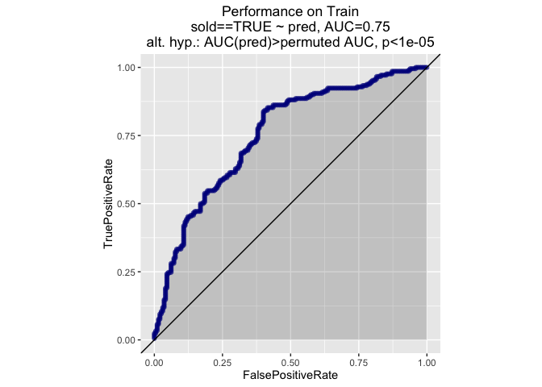
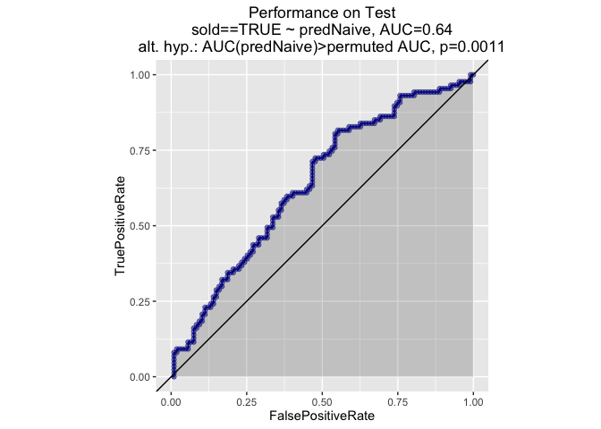
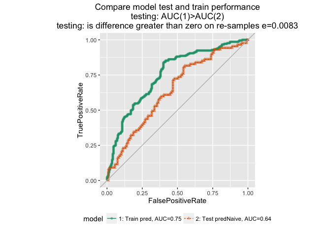
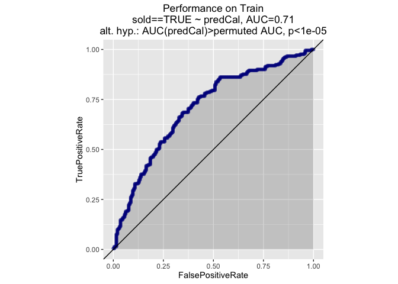
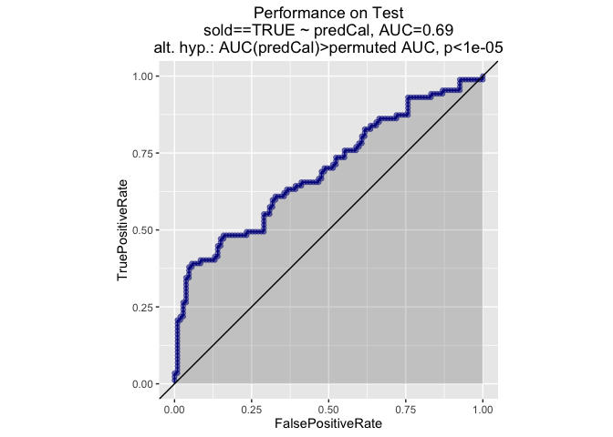
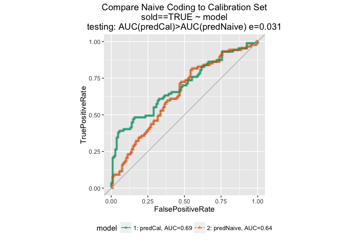
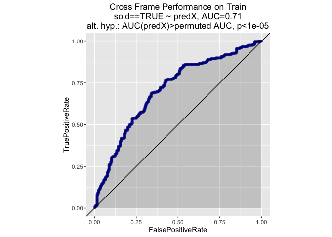
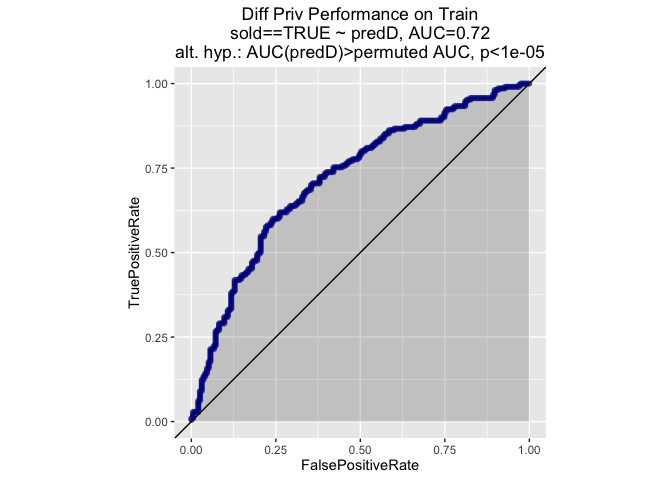
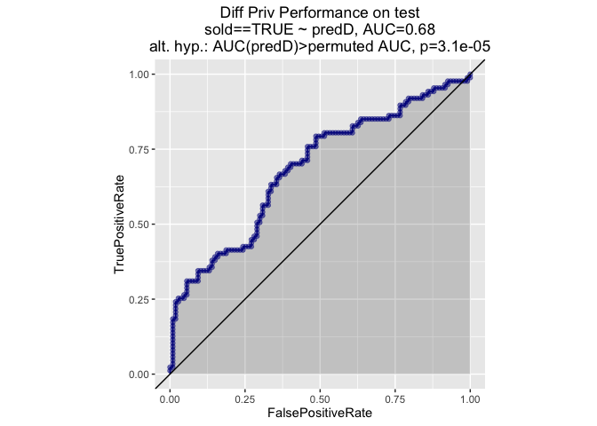
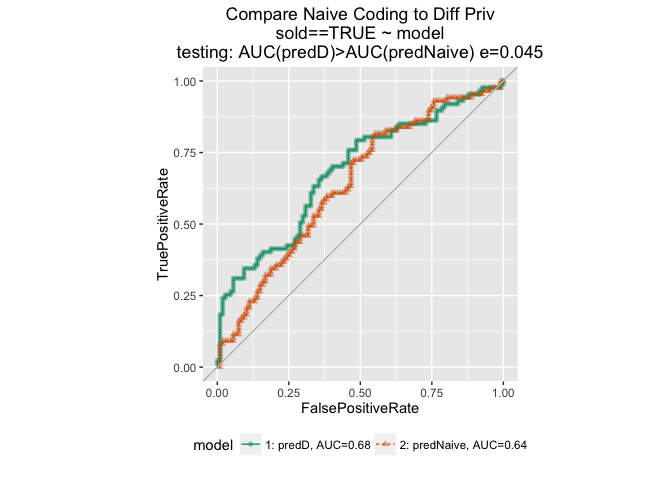

Build data

``` r
set.seed(3424572)
Nz = 100
zip <- paste0('z',format(1:Nz, justify="right"))
zip = gsub(' ', '0', zip, fixed=TRUE)

N = 1000

zipvar = sample(zip,N,replace=TRUE)
price = rlnorm(N, meanlog=log(200000))

# "popularity" of house dependent only on price
noisemean = -mean(log(1/price))
popularity = log(1/price) + rnorm(N, mean = noisemean)

sold = popularity > 0
# add more unexplained noise -- random flips
sold = ifelse(runif(N) < 0.2, !sold, sold)

df = data.frame(zip=zipvar, price = price, sold=sold)

gp = sample(c("train", "cal", "test"), size=N, replace=TRUE, prob=c(0.4, 0.4, 0.2))

train = df[gp=="train",]
cal = df[gp=="cal", ]
test = df[gp=="test",]
```

Naive
-----

``` r
bigtrain = rbind(train, cal)

treatplan.naive = vtreat::designTreatmentsC(bigtrain, "zip", 
                          outcomename="sold", 
                          outcometarget=TRUE, verbose=FALSE)

bigtrain$zip_impact = vtreat::prepare(treatplan.naive, bigtrain, pruneSig=NULL)[,"zip_catB"]
train$zip_impact = vtreat::prepare(treatplan.naive, train, pruneSig=NULL)[,"zip_catB"]
test$zip_impact = vtreat::prepare(treatplan.naive, test, pruneSig=NULL)[,"zip_catB"]
```

Build a model and evaluate.

``` r
model = glm(sold ~ log(price)+zip_impact, data=bigtrain, family=binomial)
summary(model)
```

    ## 
    ## Call:
    ## glm(formula = sold ~ log(price) + zip_impact, family = binomial, 
    ##     data = bigtrain)
    ## 
    ## Deviance Residuals: 
    ##     Min       1Q   Median       3Q      Max  
    ## -2.4260  -0.9944   0.3853   0.9982   2.1795  
    ## 
    ## Coefficients:
    ##             Estimate Std. Error z value Pr(>|z|)    
    ## (Intercept)  9.01213    1.06276   8.480  < 2e-16 ***
    ## log(price)  -0.73513    0.08693  -8.456  < 2e-16 ***
    ## zip_impact   0.98732    0.12683   7.785 6.99e-15 ***
    ## ---
    ## Signif. codes:  0 '***' 0.001 '**' 0.01 '*' 0.05 '.' 0.1 ' ' 1
    ## 
    ## (Dispersion parameter for binomial family taken to be 1)
    ## 
    ##     Null deviance: 1116.8  on 805  degrees of freedom
    ## Residual deviance:  942.8  on 803  degrees of freedom
    ## AIC: 948.8
    ## 
    ## Number of Fisher Scoring iterations: 5

``` r
# just evaluate on train set, to make compatible with next experiment
train$pred = predict(model, newdata=train, type="response")
ROCPlot(train, "pred", "sold", TRUE, title="Performance on Train")
```



``` r
test$predNaive = predict(model, newdata=test, type="response")
ROCPlot(test, "predNaive", "sold", TRUE, title="Performance on Test")
```



``` r
WVPlots::ROCPlotPair2("Train", train, "pred", "sold", TRUE,
                      "Test", test, "predNaive", "sold", TRUE,
                      "Compare model test and train performance")
```



Show the one-variable models (on training data)

``` r
report = function(model) {
  complexity = model$df.null-model$df.residual
  devratio = model$deviance/model$null.deviance
  varexp = 100*(1-devratio)
   pVal = sigr::formatChiSqTest(model, pSmallCutoff=1e-12, format='ascii')$pValue
  print(paste("Complexity (degrees of freedom):", complexity))
  print(paste0("% deviance explained: ", format(varexp, digits=3),"%"))
  print(paste("p-value on Chi^2 Test on model:", format(pVal, digits=3)))
   #print(summary(model)) 
}
```

**True Complexity of ZIP variable**

``` r
mod1 = glm(sold~zip, data=train, family=binomial)
report(mod1)
```

    ## [1] "Complexity (degrees of freedom): 96"
    ## [1] "% deviance explained: 20.8%"
    ## [1] "p-value on Chi^2 Test on model: 0.0725"

**Apparent Complexity of ZIP (`zip-impact`)**

The variance explained is lower, because the impact models were trained on `bigtrain`, not `train`, which actually reduces the overfitting. If we train the impact model on `train` then the results are nearly identical to `mod1`.

``` r
mod2 = glm(sold~zip_impact, data=train, family=binomial)
report(mod2)
```

    ## [1] "Complexity (degrees of freedom): 1"
    ## [1] "% deviance explained: 7%"
    ## [1] "p-value on Chi^2 Test on model: 3.68e-10"

Calibration Set
---------------

Now use a separate data set to build the impact model.

``` r
treatplan.cal = vtreat::designTreatmentsC(cal, "zip", 
                          outcomename="sold", 
                          outcometarget=TRUE, verbose=FALSE)

train$zip_impact = vtreat::prepare(treatplan.cal, train, pruneSig=NULL)[,"zip_catB"]
test$zip_impact = vtreat::prepare(treatplan.cal, test, pruneSig=NULL)[,"zip_catB"]


model2 = glm(sold ~ log(price)+zip_impact, data=train, family=binomial)
summary(model2)
```

    ## 
    ## Call:
    ## glm(formula = sold ~ log(price) + zip_impact, family = binomial, 
    ##     data = train)
    ## 
    ## Deviance Residuals: 
    ##     Min       1Q   Median       3Q      Max  
    ## -2.1528  -1.0593   0.6249   1.0288   2.1571  
    ## 
    ## Coefficients:
    ##              Estimate Std. Error z value Pr(>|z|)    
    ## (Intercept)  9.011400   1.385940   6.502 7.93e-11 ***
    ## log(price)  -0.735368   0.113690  -6.468 9.92e-11 ***
    ## zip_impact  -0.005369   0.020916  -0.257    0.797    
    ## ---
    ## Signif. codes:  0 '***' 0.001 '**' 0.01 '*' 0.05 '.' 0.1 ' ' 1
    ## 
    ## (Dispersion parameter for binomial family taken to be 1)
    ## 
    ##     Null deviance: 560.89  on 404  degrees of freedom
    ## Residual deviance: 510.44  on 402  degrees of freedom
    ## AIC: 516.44
    ## 
    ## Number of Fisher Scoring iterations: 4

``` r
train$predCal = predict(model2, newdata=train, type="response")
ROCPlot(train, "predCal", "sold", TRUE, title="Performance on Train")
```



``` r
test$predCal = predict(model2, newdata=test, type="response")
ROCPlot(test, "predCal", "sold", TRUE, title="Performance on Test")
```



``` r
ROCPlotPair(test, "predCal", "predNaive", "sold", TRUE, title="Compare Naive Coding to Calibration Set")
```



Cross-Frame
-----------

Use cross-validation to build the models

``` r
cfe = vtreat::mkCrossFrameCExperiment(bigtrain, "zip", "sold", TRUE)

bigtrain$zip_impact = cfe$crossFrame$zip_catB
train$zip_impact = vtreat::prepare(cfe$treatments, train, pruneSig=NULL)[,"zip_catB"]
test$zip_impact = vtreat::prepare(cfe$treatments, test, pruneSig=NULL)[,"zip_catB"]

model = glm(sold ~ log(price)+zip_impact, data=bigtrain, family=binomial)
summary(model)
```

    ## 
    ## Call:
    ## glm(formula = sold ~ log(price) + zip_impact, family = binomial, 
    ##     data = bigtrain)
    ## 
    ## Deviance Residuals: 
    ##     Min       1Q   Median       3Q      Max  
    ## -2.1651  -1.0881   0.5653   1.0716   2.1697  
    ## 
    ## Coefficients:
    ##             Estimate Std. Error z value Pr(>|z|)    
    ## (Intercept)  9.06774    1.01015   8.977   <2e-16 ***
    ## log(price)  -0.74027    0.08266  -8.955   <2e-16 ***
    ## zip_impact  -0.02156    0.02136  -1.010    0.313    
    ## ---
    ## Signif. codes:  0 '***' 0.001 '**' 0.01 '*' 0.05 '.' 0.1 ' ' 1
    ## 
    ## (Dispersion parameter for binomial family taken to be 1)
    ## 
    ##     Null deviance: 1116.8  on 805  degrees of freedom
    ## Residual deviance: 1019.9  on 803  degrees of freedom
    ## AIC: 1025.9
    ## 
    ## Number of Fisher Scoring iterations: 4

``` r
# just evaluate on train set, to make compatible with next experiment
train$predX = predict(model, newdata=train, type="response")
ROCPlot(train, "predX", "sold", TRUE, title="Cross Frame Performance on Train")
```



``` r
test$predX = predict(model, newdata=test, type="response")
ROCPlot(test, "predX", "sold", TRUE, title="Cross Frame Performance on test")
```


``` r
ROCPlotPair(test, "predX", "predNaive", "sold", TRUE, title="Compare Naive Coding to Cross Frame")
```


DiffPriv
--------

Use Laplace noise differential privacy to build the models. We just chose a typical noising rate instead of searching for an optimal rate on held-out or cross-validated data.

``` r
# See: http://www.win-vector.com/blog/2015/10/a-simpler-explanation-of-differential-privacy/
rlaplace <- function(n,sigma) {
  if(sigma<=0) {
    return(numeric(n))
  }
  rexp(n,rate = 1/sigma) - rexp(n,rate = 1/sigma)
}

# add in pseudo-observations to get diff priv Laplace noising into counts
bigtrainnoised <- bigtrain[,c('zip','sold')]
bigtrainnoised$wts <- 1
levels <- unique(bigtrainnoised$zip)
sigma <- 10
synObs <- do.call(rbind,lapply(levels,
                               function(li) {
                                 data.frame(zip=li,
                                            sold=c(TRUE,FALSE),
                                            wts=c(max(0,rlaplace(1,sigma)),
                                                  max(0,rlaplace(1,sigma))))
                               }))

# append the synthetic observations to the training data
bigtrainnoised <- rbind(bigtrainnoised,synObs)

# the treatment plan uses the noised observations to impact code
treatplan.diffpriv = vtreat::designTreatmentsC(bigtrainnoised, "zip", 
                                               weights=bigtrainnoised$wts,
                          outcomename="sold", 
                          outcometarget=TRUE, verbose=FALSE)

bigtrain$zip_impact = vtreat::prepare(treatplan.diffpriv, bigtrain, pruneSig=NULL)[,"zip_catB"]
train$zip_impact = vtreat::prepare(treatplan.diffpriv, train, pruneSig=NULL)[,"zip_catB"]
test$zip_impact = vtreat::prepare(treatplan.diffpriv, test, pruneSig=NULL)[,"zip_catB"]


model = glm(sold ~ log(price)+zip_impact, data=bigtrain, family=binomial)
summary(model)
```

    ## 
    ## Call:
    ## glm(formula = sold ~ log(price) + zip_impact, family = binomial, 
    ##     data = bigtrain)
    ## 
    ## Deviance Residuals: 
    ##     Min       1Q   Median       3Q      Max  
    ## -2.1858  -1.0663   0.5383   1.0443   2.0833  
    ## 
    ## Coefficients:
    ##             Estimate Std. Error z value Pr(>|z|)    
    ## (Intercept)  8.92842    1.01532   8.794  < 2e-16 ***
    ## log(price)  -0.72821    0.08305  -8.768  < 2e-16 ***
    ## zip_impact   0.23622    0.06205   3.807 0.000141 ***
    ## ---
    ## Signif. codes:  0 '***' 0.001 '**' 0.01 '*' 0.05 '.' 0.1 ' ' 1
    ## 
    ## (Dispersion parameter for binomial family taken to be 1)
    ## 
    ##     Null deviance: 1116.8  on 805  degrees of freedom
    ## Residual deviance: 1003.6  on 803  degrees of freedom
    ## AIC: 1009.6
    ## 
    ## Number of Fisher Scoring iterations: 4

``` r
train$predD = predict(model, newdata=train, type="response")
ROCPlot(train, "predD", "sold", TRUE, title="Diff Priv Performance on Train")
```



``` r
test$predD = predict(model, newdata=test, type="response")
ROCPlot(test, "predD", "sold", TRUE, title="Diff Priv Performance on test")
```



``` r
ROCPlotPair(test, "predD", "predNaive", "sold", TRUE, 
            title="Compare Naive Coding to Diff Priv")
```


